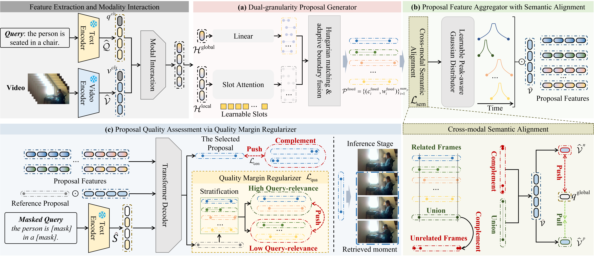

# PC-Net: Weakly Supervised Compositional Moment Retrieval via Proposal-Centric Network

With the exponential growth of video content, video moment retrieval (VMR) aims to localize relevant moments using natural language queries. Existing fully supervised methods require labor-intensive temporal annotations, while weakly supervised approaches struggle with compositional queries containing novel syntactic structures or unseen words. To address this, we propose:

- **New Task**: Weakly Supervised Compositional Moment Retrieval (WSCMR)  
- **Novel Framework**: Proposal-Centric Network (PC-Net)  
  - Parameter-efficient design (54% fewer parameters than SOTA)  
  - Dual-granularity proposal generator with temporal perception  
  - Proposal feature aggregator with semantic alignment
  - Quality margin regularizer for semantic associations 

Achieves superior performance on Charades-CG and ActivityNet-CG.  

  
The overall framework of the proposed PC-Net for solving the WSCMR task consists of a
dual-granularity proposal generator that uses the dual-granularity association of video-query pairs to obtain query-relevant boundaries with frame-level temporal perception, a proposal feature aggregator for modeling discriminative features, and a query margin regularizer that helps the model capture semantic associations between proposals and queries.


---

## 🚀 Quick Start  
### 1. Installation  
```bash
# Create environment (Python 3.9+)
conda create -n pcnet python=3.9
conda activate pcnet

# Install dependencies
torch                       2.0.1
h5py                        3.9.0
fairseq                     0.12.2
nltk                        3.8.1
```

### 2. Data Preparation  
#### Video Features  

Consistent with existing weakly supervised methods (e.g. [CPL](https://github.com/minghangz/cpl) ), we use C3D and I3D to extract video features from ActivityNet and Charades datasets, and use SlowFast and C3D to extract video features from Ego4D and TACoS. Please refer to the description of the experimental setup in the paper to obtain relevant features. 


#### Additional Features of Other Datasets  
If you need to extract the GLoVe feature pkl file or visual features of additional datasets, you can refer to the following script.
- Download GloVe.840B.300d.txt to `data/`  
- Process features:  
```bash
python build_vocab.py  # Generate vocabulary & features
python convert_npy_to_hdf5.py  # Convert video features
```

#### Configuration  
After obtaining the corresponding video features, you need to change the path in the corresponding configuration file. Update feature paths in config files:  
```yaml
# Example: config/activitynet/main_train_test.json
feature_path: "/path/to/your/activitynet_features.hdf5"
```

### 3. Training  
```bash
# For Charades-CG
bash scripts/CharadesSTA.sh

# For ActivityNet-CG
bash scripts/ActivityNet.sh
```
*Comment out `eval` sections before training.*

### 4. Evaluation  
1. Uncomment `eval` sections  
2. Update checkpoint paths in scripts:  
```bash
# In scripts/CharadesSTA.sh
resume='checkpoints/CharadesSTA/8_2025-05-14_13-26-12/model-best.pt'
```
3. Run evaluation script:  
```bash
bash scripts/CharadesSTA.sh
```
*Results will be saved in `checkpoints/<dataset>/*.log`.*

---

## 🗂 Code Structure  
```
├── checkpoints/       # Training logs and model weights
├── config/            # Dataset/model configurations (json files)
├── data/              # Dataset splits and GloVe embeddings
│   ├── *.json
│   └── glove.pkl
├── datasets/          # Data loading modules
├── models/            # Core network architecture
├── optimizers/        # Optimizer configurations
├── runners/           # Training/evaluation pipelines
└── scripts/           # Launch scripts for experiments
```

---


